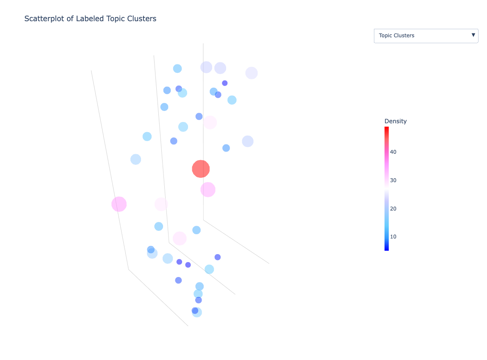
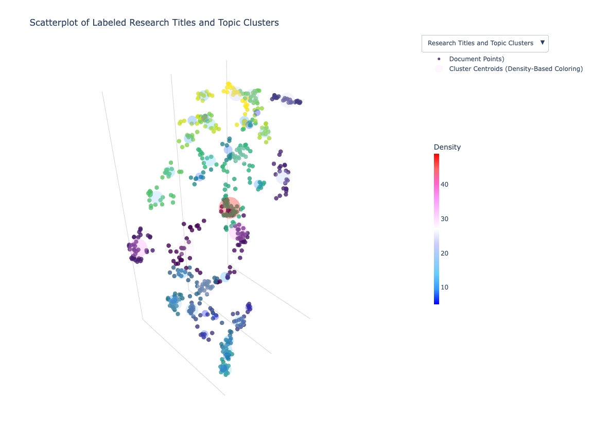

# ResearchExtractorAndSummarizer 

A Python-based toolkit designed to extract, process, summarize, and visualize academic research papers. The goal of this project is to enable large-scale visualization of research papers, allowing researchers, students, and professionals to explore academic fields interactively and gain insights into research trends, topic clusters, and emerging areas of study.


## Features

1. **Extract Full Papers and Abstracts**:
   - Retrieve research papers and metadata from arXiv based on categories, date ranges, and other filters.

2. **Generate Summaries**:
   - Summarize text using generative language models (LLMs).

3. **Embedding and Dimensionality Reduction**:
   - Create semantic embeddings of text using SentenceTransformers.

4. **Interactive Visualization**:
   - Cluster and visualize research topics 


## Dependencies

The project relies on the following Python libraries and tools:

- **`arxiv`**: For fetching metadata and papers from arXiv.
- **`PyPDF2`**: For parsing and extracting text from PDF files.
- **`spacy`**: For natural language processing (e.g., tokenization).
- **`sentence-transformers`**: For generating embeddings.
- **`scikit-learn`**: For dimensionality reduction (PCA) and preprocessing.
- **`umap-learn`**: For non-linear dimensionality reduction.
- **`hdbscan`**: For clustering research papers.
- **`plotly`**: For interactive visualization of clusters.
- **`tqdm`**: For progress bars in long-running scripts.

### Installation

Install the required dependencies by running:
```bash
pip install -r requirements.txt

```

## Visualization Example

The tool generates interactive visualizations that group research papers into topic clusters, allowing users to explore the field and identify trends. Below is an example of the final output:






## How to Use

1. **Extract Papers or Abstracts**:
   Use `arxiv_abstract_extractor.fetch_arxiv_abstracts` or `arxiv_full_paper_extractor` to fetch papers based on categories and date ranges.

2. **Generate Embeddings**:
   Use `embedings.py` to transform text into embeddings for clustering and dimensionality reduction.

3. **Generate Summaries**:
   Apply `summary_visual.py` to create concise summaries of papers using LLMs.

4. **Create Visualizations**:
   Cluster papers using HDBSCAN or other clustering algorithms and visualize using Plotly or similar libraries.


## Applications

- Explore emerging trends in academic research.
- Identify densely researched areas and research gaps.
- Collaborate on interdisciplinary topics by identifying overlaps between fields.

---

## Future Improvements

- Add support for more academic databases (e.g., PubMed, IEEE Xplore).
- Integrate with more advanced clustering and visualization libraries.
- Enhance user interactivity with web-based exploration tools.


